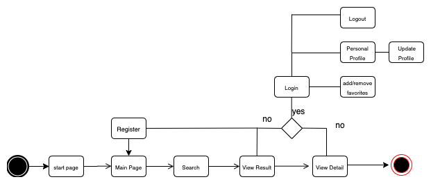

# Introduction

GHIBLI GUIDE catalogs the people, places, and things found in the worlds of Ghibli. The benefits of signing up are that you can add your favourite films to your watchlist.

## Functional Description

You can search by category all the ghibli world films, vehicles, people, species and locations, and the applications have a search bar to search by word.
The App have the functionality to add your favourite films to your watchlist from results list and from details films.

## Features

<ul>
    <li>Search by query</li>
    <li>Search by categories
        <ul>
            <li>Films</li>
            <li>People</li>
            <li>Species</li>
            <li>Vehicles</li>
            <li>Locations</li>
        </ul>
    </li>
    <li>View details</li>
    <li>Add films to watchlist</li>
</ul>

### [Use Cases] 

### [Flows] 

### [Block] 

